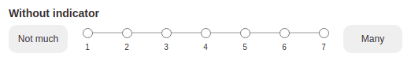

<!-- README.md is generated from README.Rmd. Please edit that file -->

```{r, include = FALSE}
knitr::opts_chunk$set(
  collapse = TRUE,
  comment = "#>",
  fig.path = "man/figures/",
  out.width = "100%"
)
```

# shiny.quetzio

<!-- badges: start -->
[](https://lifecycle.r-lib.org/articles/stages.html#experimental)
[](https://app.codecov.io/gh/StatisMike/shiny.quetzio?branch=main)
<!-- badges: end -->

This package includes the way to create a questionnaire using various Shiny widgets
from a source file: either a local YAML file, or GoogleSheet over the net.
Results of the surveys are send to GoogleSheet of your choice.

It is all completely handled by `R6` shiny modules, so it is easy to include 
even multiple independent questionnaires in your ShinyApp and keep your code clean!

- Preview the `pkgdown` generated website [here](https://statismike.github.io/shiny.quetzio/){target="_blank"}
- View the interactive demo hosted on shinyapps [here](https://statismik.shinyapps.io/quetzio-demo/){target="_blank"}

## Installation

You can install the development version of shiny.quetzio from *GitHub* with:

``` r
# install.packages("devtools")
devtools::install_github("StatisMike/shiny.quetzio")
```
## Main features

At the current stage of development the `shiny.quetzio` survey generation is
handled mainly by two `R6` classes used in server, corresponding functions 
to bind the UI in your shinyApp and some helper functions.

* `Quetzio` to create single questionnaire (you can create it with 
`Quetzio_create()` function) and `Quetzio_UI` to input the UI of the 
questionnaire. Questionnaires at the moment handles these type of inputs:
  - `textInput`
  - `numericInput`
  - `selectizeInput`
  - `radioButtons`
  - `likertRadioButtons` (custom input type - for more information read the
  corresponding subsection of "Other features" section)

* `QuetzioLink` to link multiple `Quetzio` objects (you can create it with 
`QuetzioLink_create()` function) and `QuetzioLink_UI` to bind the connected UI.

* Helper generic functions that work with both `Quetzio` and `QuetzioLink`
objects:
  - `Quetzio_label_update()`
  - `Quetzio_value_update()`
  - `Quetzio_get_df()`

>Choosing `numericInput` for item type, the object that will be generated is
actually custom input widget: `numInput`. It allows no initial value and 
placeholder text.

### In-App usage

It's usage is very straigtforward:

1. Simply add a `Quetzio` object in your shinyApp `server()` call, and `Quetzio_UI`
in your `ui`:

```{r, eval = F}
ui <- fluidPage(
  Quetzio_UI("yaml_module"),
  Quetzio_UI("gsheet_module")
)

server <- function(input, output, session) {

# YAML generated survey with output automatically saved to googlesheets

yaml_quetzio <- Quetzio_create(
  source_method = "yaml",
  source_yaml = "some_yaml",
  output_gsheet_id = "googlesheet_id",
  output_gsheet_sheetname = "sheet_name_with_questions",
  module_id = "yaml_module"
)

# survey generated from googlesheet source, with output automatically saved to
# googlesheets

gsheet_quetzio <- Quetzio_create(
  source_method = "gsheet",
  source_gsheet_id = "googlesheet_id",
  source_gsheet_sheetname = "sheet_name_with_questions",
  # you don't need to specify another googlesheet file to save answers
  # If you don't specify it, the class assumes it is the same as source one
  output_gsheet_id = "another_googlesheet_id",
  output_gsheet_sheetname = "sheet_name_with_answers",
  module_id = "gsheet_module"
)

}
```

2. Additionally, your ShinyApp can monitor the questionnaire status and react fully customizable!

```{r, eval = F}
  
# trigger some action after the questionnaire is completed
  observe({
    req(yaml_quetzio$is_done())
    showModal(
      modalDialog("You're done!")
    )
  })

# catch the answers provided to the questionnaire
  output$gsheet_answers <- renderPrint(
    gsheet_quetzio$answers()
  )

```

3. There is also a possibility to link your questionnaires in a way that they
will appear one after another with `QuetzioLink` R6 class:

```{r, eval = F}
ui <- fluidPage(
  QuetzioLink_UI("modules_link")
)

server <- function(input, output, session) {

# Linked questionnaires - one generated from yaml, second from googlesheets. 
# Their output won't be automatically saved to googlesheets in this example
# (though it is possible to set - their internal reactivity is independent
# to the quetzio_link in that regard)

  quetzio_link <- QuetzioLink_create(
    yaml_quetzio = Quetzio_create(
      source_method = "yaml",
      source_yaml = "some_yaml",
      module_id = "yaml_module"
    ),
    gsheet_quetzio = Quetzio_create(
      source_method = "gsheet",
      source_gsheet_id = "googlesheet_id",
      source_gsheet_sheetname = "sheet_name_with_questions",
      module_id = "gsheet_module"
    ),
    link_id = "modules_link"
  )

  # and you can also trigger things based on the completion rate
  
  # trigger some action after the link is 50% completed and after completion
  # of both questionnaires
  observe({
    if (quetzio_link$completion() == 0.5) {
      showModal(
        modalDialog("You're half done!")
      )
    } else if (quetzio_link$completion() == 1) {
      showModal(
        modalDialog("You're completely done!")
      )
    }
  })

# catch the answers provided to the questionnaire
  output$all_answers <- renderPrint(
    quetzio_link$answers()
  )

}
```


### Survey configuration

You can configure your survey widely, using many of the features native to the
used shiny inputs. 

#### Universal parameters:

For every input you can specify:

- **inputId**
- **type**
- **label**
- mandatory: (true/false) if the input must be filled
- width: the same as in regular input specification. If not provided, defaults
to 500px

> *Bold* ones are mandatory for every input

#### Type-specific parameters:


|    parameter   |  textInput |numericInput|selectizeInput|radioButtons|likertRadioButtons|
|    :----:      |   :----:   |   :----:   |    :----:    |   :----:   |      :----:      |
|placeholder     |      x     |     x      |       x      |            |        x         |
|regex           |      x     |            |              |            |                  |
|value           |            |     x      |              |            |                  |
|min             |            |     x      |              |            |                  |
|max             |            |     x      |              |            |                  |
|step            |            |     x      |              |            |                  |
|choices         |            |            |     **x**    |    **x**   |                  |
|choiceValues    |            |            |     **x**    |    **x**   |      **x**       |
|choiceNames     |            |            |     **x**    |    **x**   |      **x**       |
|maxItems        |            |            |       x      |            |                  |
|create          |            |            |       x      |            |                  |
|maxOptions      |            |            |       x      |            |                  |
|selected        |            |            |       x      |      x     |        x         |
|inline          |            |            |              |      x     |                  |

> Parameters with bolded **x** are mandatory. You can specify either *choices* 
or both *choiceValues* and *choiceNames* for `selectizeInput` and `radioButtons`.

## Other features

For more information about these, check vignettes and documentation.

- add instructions and additional item descriptions (also with *html* tags!)
- randomize order of items
- customize messages shown
- pre-fill questionnaire with list of values
- change labels depending on `reactive` expression value
- customize automatically generated messages
- add custom css rules for generated elements

### Input to handle questions with Likert scoring scale

`likertRadioButtons` is new input type created to accomodate the lack of
input that is meeting all requirements to create good looking and functional
input for questions with Likert-like scoring scale

  - supports no initial selected value - which is essential to make sure that
  the questionee selected the value themmselves. It is based on *radio* HTML input.
  - displays semantic meaning of each value, or just *min* and *max*
    - meaning of every value is displayed only if the user selects to make the
    UI clean and presentable
    - meaning of *min* and *max* values are displayed on left and right side of
    the scoring scales
  - sends the selected value to the server in its numeric form
  - *UI presentation*:
    - **with indicator** of the meaning of currently selected value (appears in place of
    placeholder *Select value* - placeholder text also customizable!)
    
    ```{r likertRadioButtons_w_ind, echo = F, out.width = '518px', fig.align = "center"}
    knitr::include_graphics("reference/figures/likertRadioButtons_w_ind.png")
    ```
    
    - **without indicator** - only meaning of *min* and *max*
    
    ```{r likertRadioButtons_wo_ind, echo = F, out.width = '522px', fig.align = "center"}
    
    ```

>Currently the usability of `likertRadioButtons` is limited - there is no way
to update the value after rendering with `updateLikertRadioButtons` function. 
It is planned to implement this sometime in the future. 
>For the time being, if you plan to use it outside of `Quetzio` and update
its value reactively, it is advised to do it using `renderUI`.

## discoRd kudos

This package is created by the 'discoRd' community. Feel free to join our 
[discoRd channel](https://discord.gg/FuTSvkSCVj){target="_blank"}!
